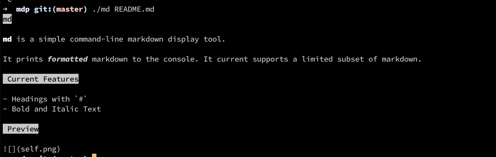

# md

**md** is a simple command-line markdown display tool.

It prints *formatted* markdown to the console. It current supports a limited subset of markdown.

## Current Features

 - Headings with `#`
 - Bold and Italic Text

## Preview

